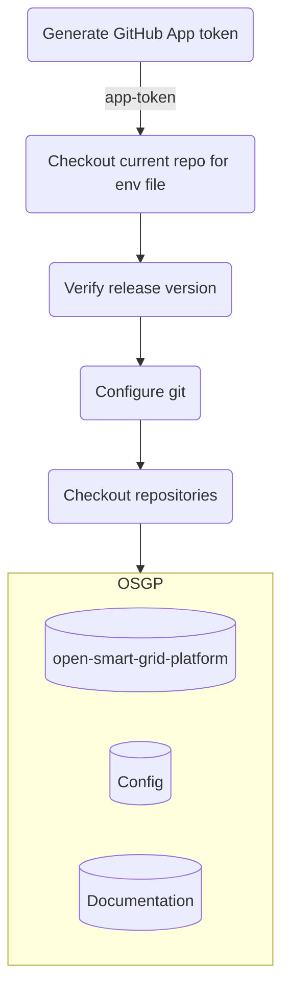
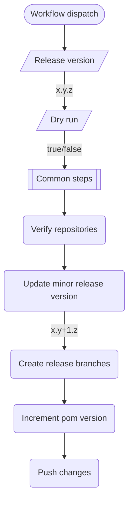
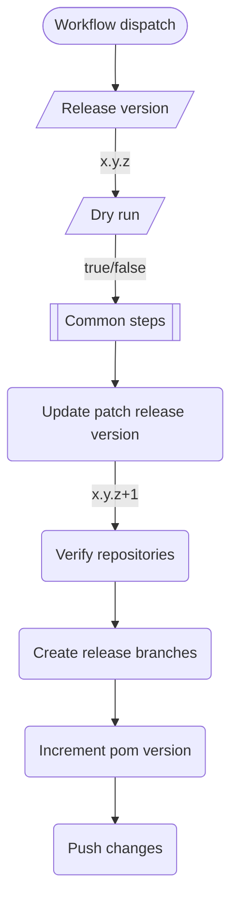
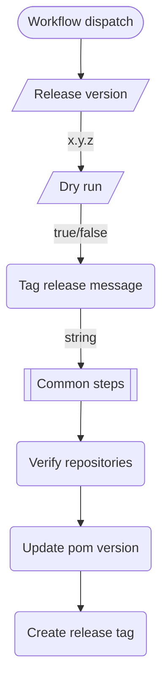

# Release process
[Back to GitHub actions documentation](../../.github/workflows/README.md)

The release process is responsible for managing our application version. The chosen release strategy is one uniform version for all components.

For major or minor releases:
* Run create release branch workflow to create a new release branch and increment the version on the development branch
* Run create final release workflow to create a release tag and trigger a new release build

For patch (bugfix) releases:
* Run create patch release branch to create a new release branch
* Implement the bugfix
* Run create final release workflow to create a release tag and trigger a new release build 

## Workflows 
- [create-release-branch](https://github.com/OSGP/open-smart-grid-platform/actions/workflows/create-release-branch.yml)
- [create-patch-release-branch](https://github.com/OSGP/open-smart-grid-platform/actions/workflows/create-patch-release-branch.yml)
- [create-final-release](https://github.com/OSGP/open-smart-grid-platform/actions/workflows/create-final-release.yml)

## Triggers
- [Manually - create release branch](https://github.com/OSGP/open-smart-grid-platform/actions/workflows/create-release-branch.yml?query=event%3Aworkflow_dispatch++)
- [Manually - create patch release branch](https://github.com/OSGP/open-smart-grid-platform/actions/workflows/create-patch-release-branch.yml?query=event%3Aworkflow_dispatch)
- [Manually - create final release](https://github.com/OSGP/open-smart-grid-platform/actions/workflows/create-final-release.yml?query=event%3Aworkflow_dispatch)

## Table of Contents
- [common](#Common)
- [create-release-branch](#Create release branch)
- [create-bugfix-release-branch](#Create patch release branch)
- [create-final-release](#Create final release)

## Common
This section describes the common steps used in each of the following workflows

### Steps
* Generate GitHub App token, generates a token to be used for github authentication (and authorization)
* Checkout current repo for env file, checks out the repository so that the environment variables inside the .env file can be used
* Verify release version, checks the release version input parameter
* Configure git, configures git to use the github app token amongst others
* Checkout repositories, checks out all repositories listed in the .env file

### Workflow diagram

## Create release branch
This workflow creates new release branches `release-x.y.0` and 
increases the minor version from *x.y.0-SNAPSHOT* to *x.y+1.0-SNAPSHOT* in the main (development) branches for the OSGP repositories listed in the .env file

### Inputs
- *Release version*, the version to increment upon (format x.y.z), referred to as x.y.z in this document.
- *Dry run*, flag indicating whether it concerns a dry run, so that changes will not be pushed.

### Steps
* _Common steps, see [above](#Common)_
* Verify repositories, checks the release version inside the pom files
* Update minor release version, determines the new minor version to be used in the main (development) branch
* Create release branches, creates new release branches for all the checked out repositories listed in the .env file
* Increment pom version, updates the minor release version in the pom files in the main (development) branch
* Push changes, pushes the changes to github (only when dry-run is set to false)

### Workflow diagram

## Create patch release branch
This workflow creates new patch release branches *release-x.y.z+1* for the OSGP repositories listed in the .env file and
updates the version in the maven pom files from *x.y.z* to *x.y.z+1* inside the new patch release branches.

### Inputs
- *Release version*, the version to increment upon (format x.y.z), referred to as x.y.z in this document.
- *Dry run*, flag indicating whether it concerns a dry run, so that changes will not be pushed.

### Steps

* _Common steps, see [above](#Common)_
* Update patch release version, determines the new patch version to be used in the new patch release branch
* Verify repositories, checks the release version inside the pom files
* Create release branches, creates new patch release branches for all the checked out repositories listed in the .env file
* Increment pom version, updates the patch release version in the pom files in the patch release branches
* Push changes, pushes the changes to GitHub (only when dry-run is set to false)

### Workflow diagram

## Create final release
This workflow finalize the release by removing the *-SNAPSHOT* suffix from the version in the pom files
in the release branches *release-x.y.z* and creating new release tags, which will trigger a new release build.

### Inputs
- *Release version*, the version to create a final release for (format x.y.z).
- *Dry run*, flag indicating whether it concerns a dry run, so that changes will not be pushed.
- *Tag release message*, the message to be used in the release tag.

### Steps
* _Common steps, see [above](#Common)_
* Verify repositories, checks the release version inside the pom files
* Update pom version, updates the version in the pom files, when needed, by removing the *-SNAPSHOT* suffix in the release branches 
  and pushes the changes (only when dry run is set to false) 
* Create release tag, creates a new release tag, using the provided tag release message and release version (only when dry run is set to false)

### Workflow diagram

